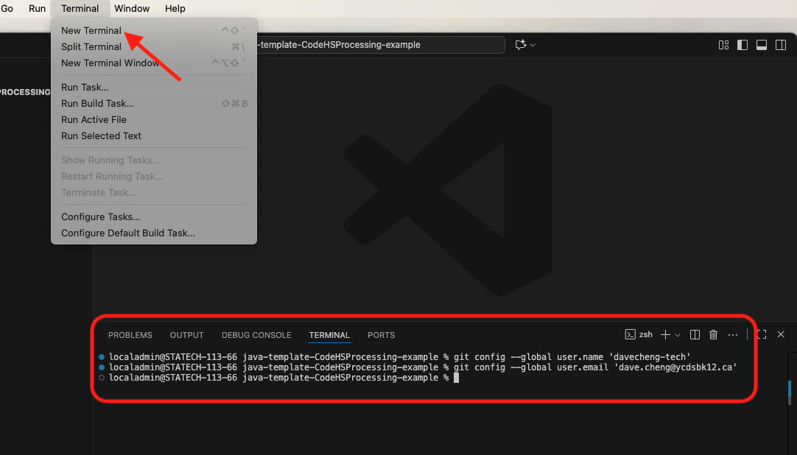

# Setting Up Your IDE
Whether you’re working in our school lab or on your own computer at home, you’ll need to go through the process of installing and/or configuring your development environment. The lab machines don’t come fully set up, so you’ll still have to handle things like signing in, authorizing GitHub, and adjusting Visual Studio Code. 

While this setup may seem complex at first, learning how to do it is valuable. Programmers everywhere are expected to configure their own tools. Once you’ve done it a couple of times, the process will feel much more routine.

## Installing Applications

### Step 1: Install Visual Studio Code for Java
Visual Studio Code has a [Coding Pack for Java](https://code.visualstudio.com/docs/languages/java) bundle that includes most of the components you'll need to start programming.


Download it [here](https://code.visualstudio.com/docs/languages/java) for Windows or macOS, or click the direct download links below:

- [Download the Coding Pack for Java - Windows](https://aka.ms/vscode-java-installer-win)
- [Download the Coding Pack for Java - macOS](https://aka.ms/vscode-java-installer-mac)

Once you've downloaded the file, unzip the archive and run the installer.


### Step 2: Install Git
Download and run the appropriate git installer for your computing environment:

- **Windows**: https://git-scm.com/download/win  
  - Recommended: Click the first link on the page above for the latest 64-bit version of Git for Windows.

- **Mac**: https://git-scm.com/book/en/v2/Getting-Started-Installing-Git
  - Recommended: First, install **Homebrew** from the macOS *Terminal* app by following the directions at https://brew.sh/  
  - Once Homebrew is installed, run the command `brew install git`, again in Terminal.

- **Linux**: https://git-scm.com/downloads/linux
  - Recommended: Use the appropriate package installer for your Linux distribution.

  


## Configuring, Cloning, and Committing

### Step 3: Launch Visual Studio Code
With both Visual Studio Code and Git installed, you can now open the Visual Studio Code application. 

A few notes and checks before you continue:

#### Skip Everything
You can skip most of the onboarding and initial configuring by clicking **Mark Done**:
  

#### Close the Copilot Panel
Copilot is GitHub's built-in A.I. assistant and chat. It brings the power of A.I. tools like ChatGPT right into the code editor. For beginners, this is more of a distraction than a help. It can give you answers without you understanding the steps, which slows down real learning. 

At this stage we want you to practice writing and fixing your own code, not just copying suggestions. Resist the temptation and close this panel.


#### Check for Git 
Look for the **Clone Git Repository** option on the *Welcome* screen. If you don't see this option, check that Git is properly installed (Step 2, above).


### Step 4: Clone Your Repository
GitHub Classroom should have generated a private repository for your work. Clone this repository to begin working on it.
1. From the GitHub page for the repo, click on **Code** and copy the URL to the clipboard:


2. In the new Visual Studio Code window, click on **Clone Git Repository**.

3. Paste the URL from the clipboard into the text field at the top of the window (called the *Command Palette*) and press return.

4. You'll be asked where you want to save this cloned folder, for example below, choose your *Documents* folder.  
  
5. Open your cloned repository.

6. Authorize **Trust** for the folder contents.


#### First Time? Configure GitHub!
If this is your first time cloning a repository on this setup, you'll need to do a few additional steps.

1. Allow GitHub to sign in with Visual Studio Code.:


2. A web browser should open. Type your GitHub username and password to authenticate. **DO NOT** click on the *Continue with Google* button.


3. Check that you are using your school GitHub account and continue.


4. Click **Allow** to be returned to Visual Studio Code.


5. Now, try cloning the repository again with **Step 4A** above.


### Step 5: Edit, Save, and Commit Changes
Make a small test edit in the repo such as adding a line to the `README.md` file. Now we will try to push these changes back to the GitHub repo online.

> **Quick Analogy**  
> - **Commit** = Save a checkpoint locally (like saving in a video game).  
> - **Push** = Send your checkpoint to the cloud (GitHub).  
> - **Pull** = Bring down the latest checkpoints from the cloud.  
> - **Sync** = Do both Push and Pull in one step.  

1. In the sidebar, click on the **Source Control** view.
2. You should see a list of **Changes** that will be a part of this Commit action. Think of it as a *snapshot of changes*.
3. Type a short message in the **Message** box, describing the changes made. *IMPORTANT: YOU **MUST** TYPE A COMMIT MESSAGE!*  
  
4. Click on **Commit** to record the snapshot.
5. Next, click on **Sync** — a combined **Push** and **Pull** action — to push the changes to the GitHub repo online.

#### Your First Commit? More Configuration!
If this is your first GitHub commit, you will get a GitHub configuration error like this:


To fix this, open a Terminal window and enter the following text commands, replacing `your_github_username` and `your_github_account_email` with your own:



```shell
git config --global user.name 'your_github_username'
```
and
```shell
git config --global user.email 'your_github_account_email'
```

For example, my personal setup would look like:

```shell
git config --global user.name 'davecheng-tech'
git config --global user.email 'dave.cheng@ycdsbk12.ca'
```

Finally, try to run the Commit and Sync actions again. 

This setup should only be necessary on your first Commit action.  

### Step 6: Verify update on GitHub (optional)
Finally, you can check the repository online (i.e. in the cloud) to verify that your latest Commit changes are reflected:


<br><br>

## FAQs and Other Issues

### Visual Studio Code Pop-Up Window
If you're using a computer in our lab, you might see a pop-up window for a "helper tool" like this:


This is Visual Studio Code trying to auto-update itself. You can safely click **Cancel** and ignore it. On your own machine, you may want to install the helper tool to allow for auto-updates.

### Git Fetch
You might see a prompt about periodically running the `git fetch` command. This updates your local copy of a repository with any changes that exist on the remote (e.g. GitHub), *without merging them into your working code*.

You still have to performa a **pull** or **sync** action to incorporate these changes into your local codebase.


